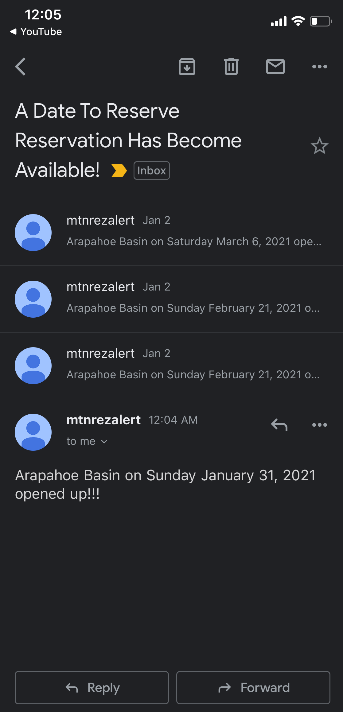
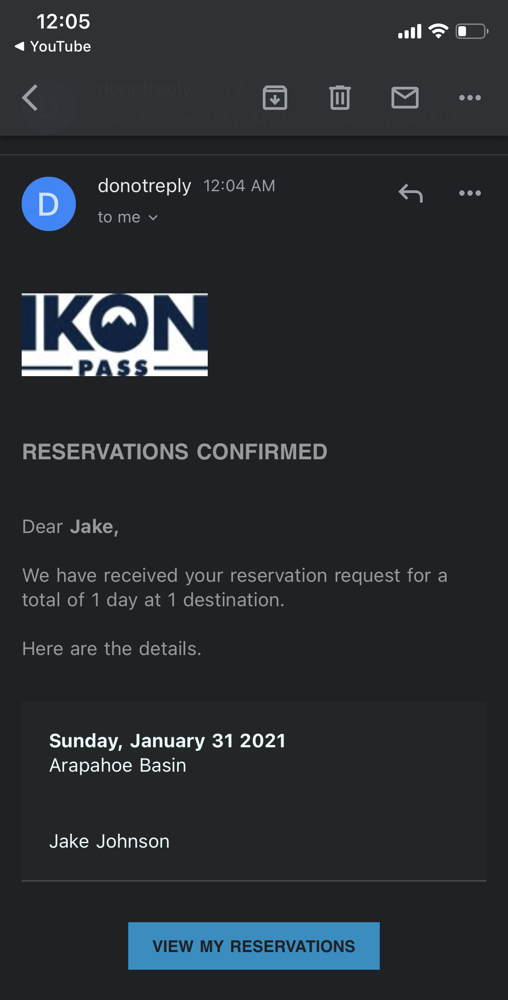

## :warning: Note
This project is out of date. However, it can be used as a starting point for a web scraping app or reservation/purchasing bot :robot:.

## :skier: Description

We were tired of waiting for reservations to open up :rage: so we made this script to automatically reserve Ikon mountain reservations when they became available :sunglasses:. This project uses python 3 :snake:, and selenium.

## :movie_camera: Demo
Shows the ikon site being clicked through automatically, the email alert for reservation opening, and reservation confirmation.
  

## :fire: Usage

- Input reservations you want in the text file datesToReserve.txt, delimited by commas
  - format: `[month],[day],[year],[mountain],[email]`
  - ie: `3,7,2021,Arapahoe Basin,billybob@gmail.com`
  	- note: if you input the same date but with a different mountain, the script will reserve first one that opens up
- Make sure the mountain name you input is the exact name used on Ikon site :mountain_snow:
- Run src/main.py [email] [password] from top directory of project with python3
  - `$py src/main.py [email] [password]`
- You can turn off headless mode to watch scraper click through site :eyes:
  - set HEADLESS to 0 in top of main.py
  - note you might not be able to if you are running on an external server
- You can change email alert settings in `ikonScraperInterface.py`
	- set `ALERT_ALL_OPENINGS` to `True` if you want to receive alerts on every reservation that becomes open since time of running script
	- comment out `emailInterface.sendDateToReserveAlertEmail()` if you don't want to receive emails after a reservation is made

## :electric_plug: Installation

#### :computer: Windows (roughly same for Mac)
- install python3
- install selenium
	- `$py -m pip install selenium`
	- use equivalent command for Mac ^
- install chrome
- install chrome driver for the version of chrome you have (86/87/88/etc) and system you are using (windows/mac)
	- Download chrome driver here: https://chromedriver.chromium.org/downloads
	- you can see your chrome version here: chrome://settings/help
- add chromedriver file to PATH or put in top directory of this project

#### :computer: Ubuntu
- install python3
	- `$sudo apt-get install python3`
- install pip
	- `$sudo apt-get install python3-pip`
- install selenium for python
	- `$py -m pip3 install selenium`
- install selenium and chrome driver for web server (just run this even if not using server)
	- `$py setup/installSelenium.py`
	- ctrl-c once this is done running
	- follow this link if anything goes wrong: https://tecadmin.net/setup-selenium-chromedriver-on-ubuntu/
- install chrome
	- `$sudo apt-get install libxss1 libappindicator1 libindicator7`
	- `$wget https://dl.google.com/linux/direct/google-chrome-stable_current_amd64.deb`
	- `$sudo apt install ./google-chrome*.deb`
- remove junk files
	- `$rm selenium-server-standalone-3.13.0.jar`
	- `$rm chromedriver_linux64`
	- `$rm testng-6.8.7.jar`
	- `$rm testng-6.8.7.jar.zip`

### Created by Jake Johnson :snowboarder: and Preston Windfeldt :skier:
Special thanks to Anthony Cudzinovica and Alex Hirst :grinning:
